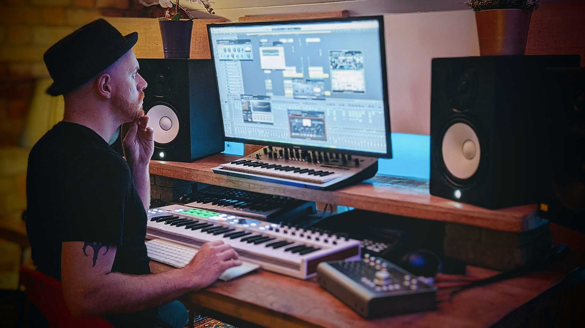
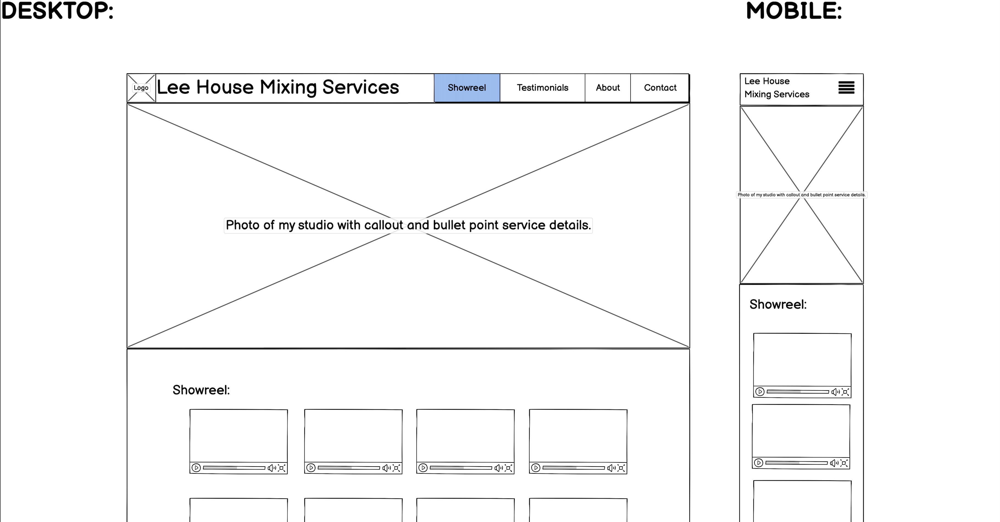
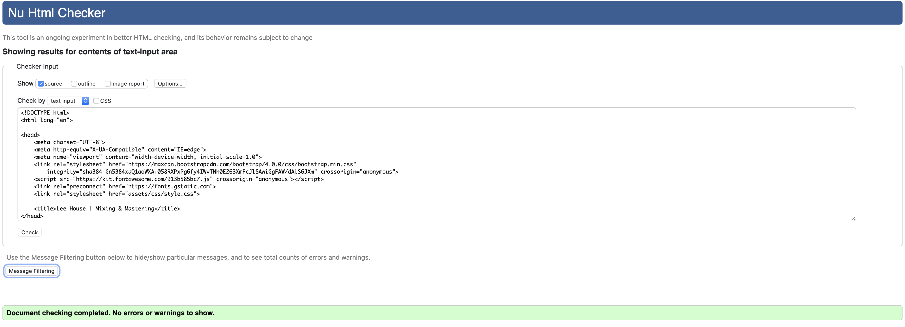
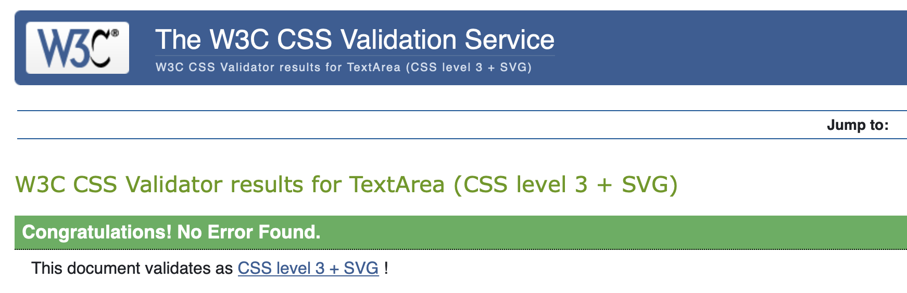

# Lee House Mixing & Mastering (Audio Engineering)

Lee House mixing and mastering is a portfolio website for myself as an audio mixing and mastering engineer. In my job as a freelancer in the music industry I have a variety of different types of work including Music Production, Audio Engineering, Composition and Music Performance. My previous website (built in wix) included portfolios for all of these different areas and when forwarding potential clients with a specific job in mind i.e song mixing, the site laid out too many other services that gave the impression that I was a 'Jack of all trades'.

My solution to this issue is to build separate websites with separate domains for each service that I offer so that I can really sell that specific role to the right customers when presenting my specific portfolios.

## Wireframe:
- Wireframe was created using Balsamiq.
- [View full wireframe here](assets/images/wireframe.png)

## Features 

I wanted this website to have a very clean and simplistic design and not have too much content; I decided that a 'one page scroll' site would help accomplish this. From customer feedback it seemed that my previous website (that was not a responsive design) made it difficult to click audio play buttons on mobile devices and therefore making the information respond to the device view size was a very important part of my design; Bootstrap 4 was used to easily make the site responsive.

### Existing Features

- __Navigation Bar__

  - Since I opted for a one page scroll site, from the beginning I decided that having a 'fixed' navigation bar would be essential so that users do not have to scroll all the way back to the top through the one page layout.

- __Landing Page__

    - The landing page has a background image that instantly lets the user know what service I offer and puts a face to the name as well as presenting bullet point information about my services and my experience.

- __Testimonials__

  - The testimonials legitamise my skills to the user before proceeding to listen so that the user listens to the portfolio in the right frame of mind.

- __Portfolio__

  - **Important:** The actual audio content on this site is not yet complete; the audio samples are Soundcloud links to random songs on my own Soundcloud page but an important feature of this portfolio will be to offer genre specific audio showreel compilation tracks that will be embedded from Soundcloud tracks that are titled with my name and the genre name of the presented showreel e.g Lee House - Pop Showreel. I have chosen 8 genre categories:
    1. Pop
    2. EDM
    3. R&B
    4. Electronic
    5. Acoustic
    6. Country
    7. Rock & Metal
    8. Classical
  
  - I did not want to create these audio compilations until I had persmission from all the creators to use their music.

- __About__

  - Contains a brief background history and draws attention to my experience and previous clients.

- __Contact__

  - A form is included for easy contact and also shows a google maps embedded location to add a graphic aspect to this section.

- __The Footer__ 

  - Footer containers links to social media using standard icons (from Font Awesome)and my full business address that hyperlinks to Google maps. I decided not to hyperlink my email as I personally find this frustrating as a user when an email link opens the system default email application when I don't used app based mail.

### Features Left to Implement

- An FAQ page in the footer to common questions that I get asked.
- Finish the audio content tracks for the embedded soundcloud showreel section.
- The contact form should send the user message to my email; it currently directs to the Code Institute dummy submit page. Through web searching it seems that PHP is needed for this function.

## Testing 

Chrome was used to created the design but this site has also been test successfully on Safari and Firefox. Chrome dev tools were used to test the site responsiveness on different mobile devices and the design was optimised for small, medium and large screen sizes.

### Validator Testing 

- HTML - [W3C Validator](https://validator.w3.org/nu/?showsource=yes&doc=https%3A%2F%2Fwinterheartlee.github.io%2Fleehousemixing2021%2Findex.html)
  - On the initial test, the validator did not like the embedded iframe code which contained obselete styling form HTML4 e.g frameborder. To overcome this issue I removed all the obselete iframe code and added a CSS class for styling the iframe width, height and border.
  
  - The site currently has no errors from the W3C Validator.
- CSS - [Jigsaw Validator](https://jigsaw.w3.org/css-validator/validator?uri=https%3A%2F%2Fwinterheartlee.github.io%2Fleehousemixing2021%2Findex.html&profile=css3svg&usermedium=all&warning=1&vextwarning=&lang=en)
  - No errors were found when passing through the official W3C Jigsaw validator.
  

### Unfixed Bugs

The text content in the 'About' section has the styling applied directly on the text on the HTML page; I had originally created a class for this text on the style.css page but for some reason the styling was not applying and I could not work out why. I think it is possibly to do with parent/child relationships of the div classes used, and whilst this is not an error, it is not good practice to apply styling directly in the HTML.

## Deployment

This site has been deployed using GitHub page, the live link can be found here - https://winterheartlee.github.io/leehousemixing2021/index.html

## Credits 

The programming languages used were HTML5, CSS3 and Javascript was loaded via the Bootstrap 4 framework for the collapsable toggle navigation.

### Frameworks, Libraries and Programs:

1. [Bootstrap 4.6:](https://getbootstrap.com/docs/4.6/getting-started/introduction/)
    - Bootstrap was used mainly for its grid features which help create the device responsive design.
1. [Google Fonts:](https://fonts.google.com/)
    - Google fonts were used to import the 'Quicksand' font into the style.css and this font was used for all the text throughout the site.
1. [Font Awesome:](https://fontawesome.com/)
    - All graphic icons were free icons from Font Awesome.
1. [GitPod](https://www.gitpod.io/)
    - GitPod was the IDE used to create the code.
1. [GitHub:](https://github.com/)
    - GitHub is used to store the projects code after being pushed from GitPod.
1. [Photoshop:](https://www.adobe.com/ie/products/photoshop.html)
    - Photoshop was used to edit images and compress them for smaller file sizes.
1. [Balsamiq:](https://balsamiq.com/)
    - Balsamiq was used to create the wireframe design.

### Media:

- Background image for the 'Showreel' section was a license free image from [Upsplash](https://unsplash.com/photos/OQlPahHa7Bc)
- Audio player and content was embedded from [SoundCloud](https://soundcloud.com)